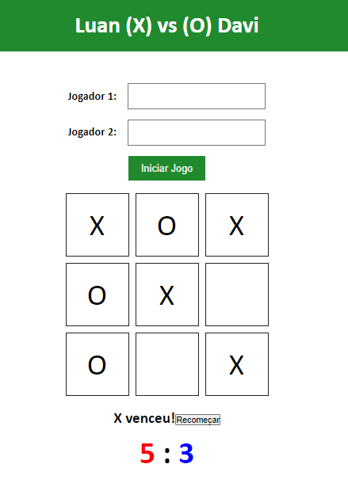

## 🧾 Descrição

Implementação de um jogo da velha para dois jogadores, utilizando HTML, CSS e JavaScript. Os jogadores inserem seus nomes em um formulário, que é utilizado para atualizar o título da página. O jogo ocorre em uma grade de 3x3, em que cada célula representa uma jogada. O jogo é reiniciado a cada vitória ou empate, ou quando o botão "Recomeçar" é clicado. O resultado da partida é exibido na tela, junto com o placar de cada jogador.
<h1>

## ⚙️ Estrutura

### **index.html**

Estrutura básica de uma página web que contém um jogo da velha. Ele define a estrutura do documento HTML com tags como ```<html>```, ```<head>```, ```<body>```, ```<header>```, ```<main>```, ```<footer>``` e outras. 
- No cabeçalho da página, é definido o título da página e um link para um arquivo de estilo CSS.
- O corpo da página contém o conteúdo visual da página, que inclui um formulário para inserir o nome dos jogadores e um tabuleiro de jogo da velha para os jogadores jogarem. 
- Há também um espaço para exibir o resultado do jogo e um contador de pontuação. 
- O rodapé da página exibe informações sobre o autor do jogo. Há também uma referência a um arquivo JavaScript externo que pode conter a lógica do jogo.

### **script.js**

Este código cria a estrutura lógica de um jogo da velha onde os jogadores podem inserir seus nomes no início do jogo. 
- Ele usa seletores do DOM para obter referências para elementos HTML específicos, como células do jogo, o resultado do jogo, as pontuações dos jogadores e um botão de reiniciar. 
- Ele adiciona um listener de eventos ao formulário para obter os nomes dos jogadores e atualizar o título do jogo de acordo. 
- Ele também adiciona um listener de eventos a cada célula do jogo para manipular o clique do jogador. 
- A função handleCellClick é chamada quando o jogador clica em uma célula do jogo e atualiza a jogada atual e o número de jogadas. 
- Ele também verifica se há um vencedor ou empate usando a função checkForWinner, que verifica todas as combinações vencedoras possíveis. Se houver um vencedor ou empate, o jogo termina e o botão de reiniciar é adicionado. 
- Se o jogador clicar no botão de reiniciar, a função restartGame é chamada para limpar o tabuleiro e reiniciar o jogo. 
- As pontuações dos jogadores são atualizadas a cada vitória.

### **style.css**

Esse código é responsável por definir o estilo visual de uma página web para um jogo da velha. 
- Ele define um conjunto de regras para definir como cada elemento HTML na página deve ser apresentado ao usuário, incluindo fontes, cores, tamanhos, posicionamento e outros atributos visuais.

- Ele define a cor de fundo e o estilo do cabeçalho, a disposição e estilização dos elementos do formulário e a aparência das células do tabuleiro do jogo da velha, incluindo cores, tamanhos e efeitos de transição. 
- Também são definidos modificadores que alteram a aparência dos elementos em situações específicas, como quando estão desabilitados ou com foco.

## ✅ Resultado (Preview)

### **Jogo da velha**




<br>

## 💻 Autor

- [@Luan Ferreira](https://github.com/fluanbrito)

<h1>

## 🚀 Sobre mim
Sou um grande entusiasta e apaixonado por tecnologia, empreendedorismo e inovação. Hoje, estou a cursar o curso de Sistema de Informação pelo Instituto Federal, faço uso profissionalmente de ferramentas e me aprofundo em temas como Marketing, Machine Learning AWS, Metodologias ágeis, Gestão de Projetos, Programação Web, Administração de Sistemas, Redes de computadores, entre outros.